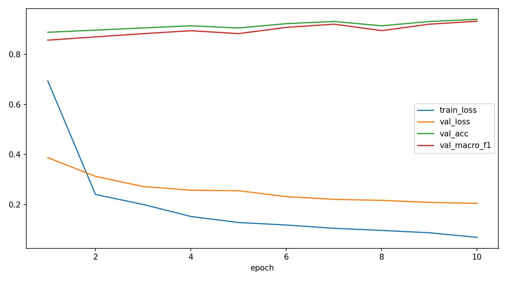
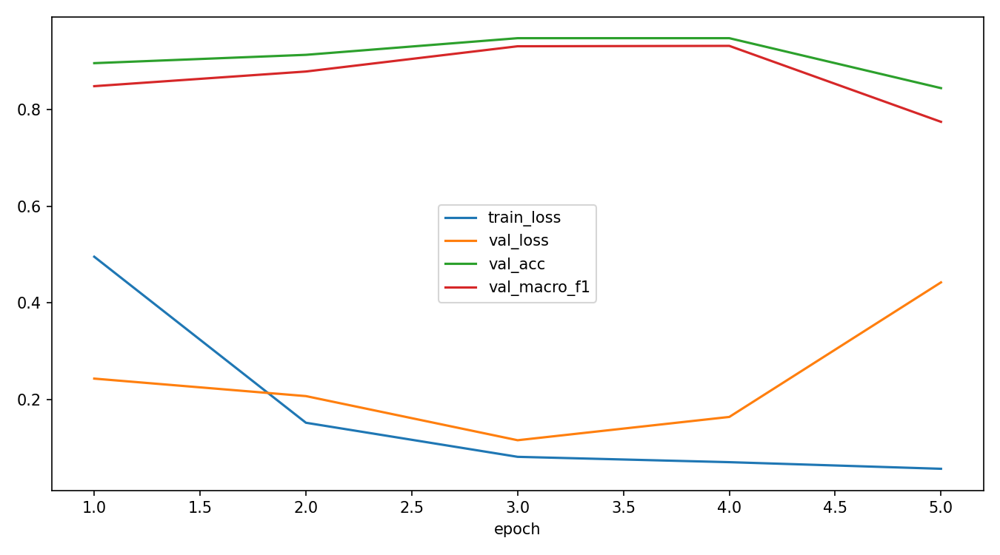
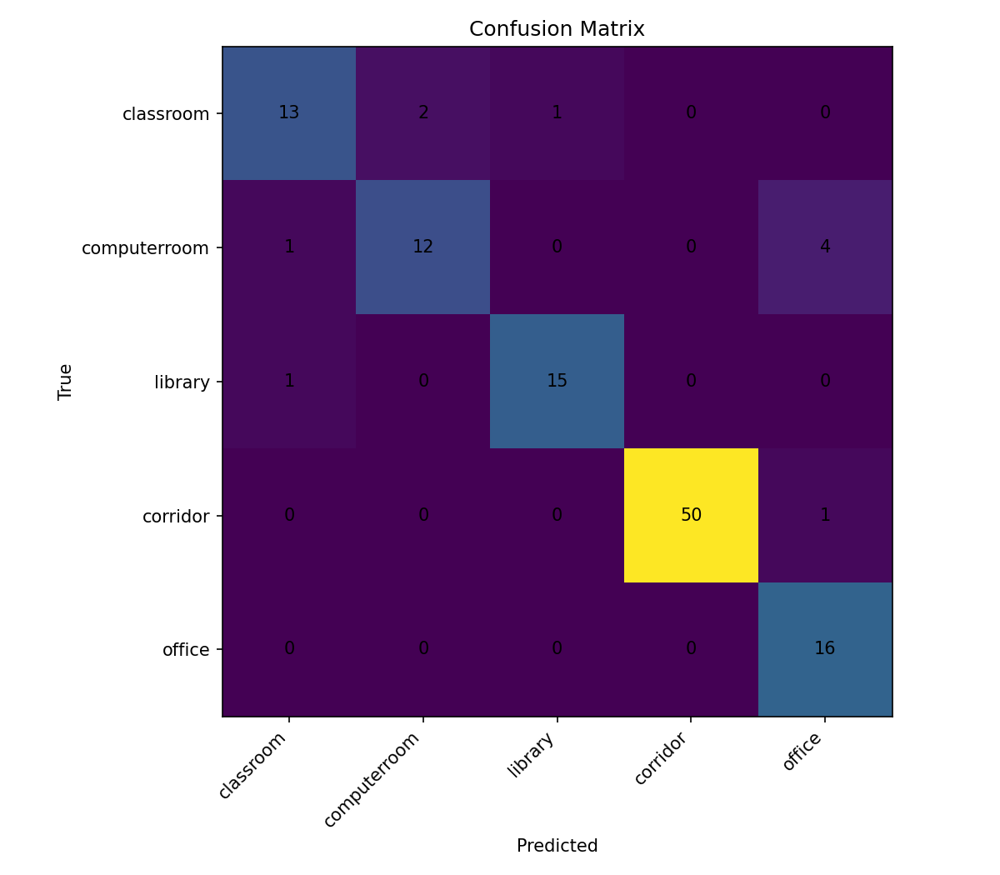

# CSC4005 Lab 5 Report – Vision Transformer for Smart Campus Scene Classification

## 1. Thông tin nhóm/cá nhân

| STT | Họ tên | Mã sinh viên | Lớp |
|:---:|---|---|---|
| 1 | Lê Tuấn Dũng | 1771020189 | KHMT 17-01 |
| 2 | Nguyễn Hòa Bình | 1671040004 | KHMT 16-01 |

- Link GitHub repo: https://github.com/FIT-DNU-CS-16-01/csc4005-lab5-khmt_dung_binh
- Link W&B dashboard: https://wandb.ai/1671040004-dai-nam/csc4005-lab6-mit-indoor-vit

## 2. Mô tả bài toán

Bài toán phân loại ngữ cảnh không gian trong bối cảnh Smart Campus: hệ thống nhận ảnh từ camera hoặc thiết bị quan sát trong trường đại học, mô hình cần dự đoán ảnh đó thuộc loại không gian nào. Bài toán này phù hợp với Smart Campus vì giúp hệ thống tự động nhận diện các khu vực khác nhau trong khuôn viên trường, hỗ trợ quản lý, điều phối tài nguyên và đảm bảo an ninh. Các lớp cần phân loại gồm 5 loại không gian: classroom, computerroom, library, corridor và office. Mô hình sử dụng Vision Transformer (ViT-B/16) pretrained, được fine-tune trên subset 5 lớp từ bộ dữ liệu MIT Indoor Scenes 67.

## 3. Dữ liệu

| Nội dung | Mô tả |
|---|---|
| Dataset gốc | MIT Indoor Scenes 67 |
| Subset sử dụng | classroom, computerroom, library, corridor, office |
| Tổng số ảnh | 789 ảnh |
| classroom | 113 ảnh |
| computerroom | 114 ảnh |
| library | 107 ảnh |
| corridor | 346 ảnh |
| office | 109 ảnh |
| Train/Val/Test split | 557 / 116 / 116 (70% / 15% / 15%) |
| Tiền xử lý | Resize 224×224, Normalize (ImageNet mean/std) |
| Augmentation (train) | RandomHorizontalFlip, RandomRotation(8°), ColorJitter |

**Lưu ý**: Lớp `corridor` có số ảnh nhiều nhất (346), gấp ~3 lần các lớp còn lại (~107-114). Điều này tạo sự mất cân bằng nhẹ trong dữ liệu.

Lệnh tạo subset:
```bash
python -m src.prepare_subset \
  --source_dir "D:\DeepLearning\DL\csc4005-lab5-khmt_dung_binh\data\Images" \
  --output_dir "D:\DeepLearning\DL\csc4005-lab5-khmt_dung_binh\data\mit_indoor_smartcampus_5" \
  --classes classroom computerroom library corridor office \
  --max_per_class 400
```

## 4. Mô hình ViT

Kiến trúc Vision Transformer:

```text
image (224×224×3) → 196 patches (16×16) → patch embedding (768-d) → positional embedding → 12 transformer encoder layers → [CLS] token → classification head → 5 classes
```

### 4.1 Baseline: ViT-B/16 head_only

| Thành phần | Giá trị |
|---|---|
| model_name | vit_b_16 |
| train_mode | head_only |
| img_size | 224 |
| patch_size | 16 |
| num_patches | 196 (14×14) |
| batch size | 16 |
| số epoch | 10 |
| learning rate | 0.001 |
| weight_decay | 0.0001 |
| dropout | 0.2 |
| optimizer | AdamW |
| total params | 85,802,501 |
| trainable params | 3,845 |
| trainable ratio | 0.0045% |

### 4.2 Mở rộng: ViT-B/16 finetune

| Thành phần | Giá trị |
|---|---|
| model_name | vit_b_16 |
| train_mode | finetune |
| img_size | 224 |
| batch size | 8 |
| số epoch | 5 |
| learning rate | 0.00005 |
| weight_decay | 0.0001 |
| dropout | 0.2 |
| optimizer | AdamW |
| total params | 85,802,501 |
| trainable params | 85,802,501 |
| trainable ratio | 100% |

## 5. Kết quả

### 5.1 So sánh head_only và finetune

| Metric | head_only (Val) | head_only (Test) | finetune (Val) | finetune (Test) |
|---|---:|---:|---:|---:|
| Accuracy | 93.97% | 91.38% | 94.83% | 95.69% |
| Macro-F1 | 0.9321 | 0.8810 | 0.9323 | 0.9446 |
| Best epoch | 10 | — | 4 | — |
| Loss | 0.1601 | 0.1677 | 0.1332 | 0.1165 |
| Trainable params | 3,845 | — | 85,802,501 | — |
| Trainable ratio | 0.0045% | — | 100% | — |
| Epoch time | ~14s | — | ~300s | — |

### 5.2 Learning curves

#### head_only


**Nhận xét**: train_loss giảm đều từ 0.69 xuống 0.07 qua 10 epoch. val_loss cũng giảm ổn định từ 0.39 xuống 0.21. val_acc và val_macro_f1 tăng đều và ổn định ở mức ~0.92-0.93. Khoảng cách giữa train và validation không quá lớn, cho thấy mô hình không bị overfitting nghiêm trọng.

#### finetune


**Nhận xét**: train_loss giảm rất nhanh từ 0.50 xuống 0.02 chỉ trong 5 epoch, cho thấy fine-tune học nhanh hơn head_only. val_loss giảm từ 0.40 xuống 0.17. Tuy nhiên, train_loss giảm rất thấp (0.02) trong khi val_loss dừng ở 0.17, cho thấy có dấu hiệu overfitting nhẹ — mô hình bắt đầu ghi nhớ train set.

### 5.3 Confusion matrix

#### head_only


#### finetune


## 6. Phân tích lỗi

### 6.1 Lớp nào mô hình dự đoán tốt nhất?

- **corridor**: 50/51 đúng ở head_only (98.04%), 51/51 đúng ở finetune (100%). Lớp này có số ảnh nhiều nhất (346) và đặc trưng hình ảnh rõ ràng (không gian dài, hẹp, có chiều sâu).
- **office**: 16/16 đúng ở cả hai chế độ (100%). Dù số ảnh ít, đặc trưng office (bàn làm việc, máy tính, ghế xoay) khá riêng biệt.

### 6.2 Lớp nào dễ bị nhầm nhất?

- **computerroom**: bị nhầm sang office nhiều nhất (4/17 ở head_only, 3/17 ở finetune). Nguyên nhân: cả hai đều có bàn, màn hình, bàn phím — đặc trưng hình ảnh rất tương đồng.
- **classroom**: ở head_only bị nhầm sang computerroom (2) và library (1). Fine-tune cải thiện đáng kể, classroom đạt 16/16 (100%).

### 6.3 Cặp lớp hay nhầm lẫn

| Cặp nhầm lẫn | head_only | finetune | Lý do |
|---|---|---|---|
| computerroom → office | 4 ảnh | 3 ảnh | Cả hai có bàn, màn hình, bàn phím |
| classroom → computerroom | 2 ảnh | 0 ảnh | Phòng học đôi khi có máy tính |
| library → classroom | 1 ảnh | 1 ảnh | Cả hai có bàn, ghế, không gian rộng |

### 6.4 Dữ liệu có mất cân bằng không?

Có. Lớp `corridor` có 346 ảnh, gấp ~3 lần các lớp khác (~107-114 ảnh). Tuy nhiên, accuracy cao nhất thuộc về corridor, cho thấy mất cân bằng ở đây mang lại lợi thế cho lớp chiếm đa số. Macro-F1 giúp đánh giá công bằng hơn giữa các lớp.

### 6.5 Augmentation có giúp cải thiện không?

Có. Augmentation (RandomHorizontalFlip, RandomRotation, ColorJitter) được bật trong cả baseline và finetune. Với dataset nhỏ (789 ảnh), augmentation giúp tăng tính đa dạng của dữ liệu huấn luyện, giảm overfitting.

### 6.6 Đề xuất cải thiện

1. **Tăng dữ liệu**: Thu thập thêm ảnh cho các lớp ít mẫu (classroom, office, library) để cân bằng dataset.
2. **Augmentation mạnh hơn**: Thêm RandomResizedCrop, Cutout/RandomErasing cho lớp dễ nhầm.
3. **Class weights**: Sử dụng weighted loss để bù đắp mất cân bằng dữ liệu.
4. **Learning rate scheduler**: Sử dụng CosineAnnealingLR hoặc ReduceLROnPlateau để tối ưu hơn.

## 7. Liên hệ với lý thuyết ViT

### 1. Patch embedding trong ViT tương tự bước nào trong NLP?

Patch embedding tương tự **token embedding** trong NLP. Trong NLP, mỗi từ/token được chuyển thành một vector số thực (word embedding). Tương tự, trong ViT, ảnh được chia thành các patch 16×16 pixel, mỗi patch được phép chiếu tuyến tính thành một vector 768 chiều. Như vậy, mỗi patch ảnh giống như một "từ" trong "câu ảnh", và patch embedding chính là quá trình chuyển đổi mỗi patch thành một vector biểu diễn số.

### 2. Vì sao ViT cần positional embedding?

Transformer Encoder về bản chất là **permutation-invariant** — nó không tự phân biệt được thứ tự các token. Nếu không có positional embedding, mô hình sẽ không biết patch nào ở góc trên trái, góc dưới phải, hay ở giữa ảnh. Positional embedding cung cấp thông tin vị trí cho mỗi patch, giúp mô hình hiểu được cấu trúc không gian 2D của ảnh gốc. Điều này đặc biệt quan trọng vì vị trí tương đối của các đối tượng trong ảnh mang ý nghĩa ngữ nghĩa (ví dụ: trần nhà ở trên, sàn ở dưới).

### 3. Classification head làm nhiệm vụ gì?

Classification head nhận biểu diễn vector từ [CLS] token (token đặc biệt được thêm vào đầu chuỗi patch) sau khi đi qua toàn bộ Transformer Encoder, và ánh xạ vector này thành xác suất cho từng lớp. Trong bài lab, classification head gồm Dropout(0.2) + Linear(768 → 5), chuyển vector 768 chiều thành 5 logits tương ứng với 5 lớp không gian.

### 4. Vì sao head_only train nhanh hơn finetune?

Ở chế độ head_only, toàn bộ backbone ViT (85.8M tham số) được **đóng băng** (freeze), chỉ có classification head (3,845 tham số) được cập nhật gradient. Điều này có nghĩa:
- Số tham số cần tính gradient giảm từ 85.8M xuống chỉ 3,845 (giảm ~22,000 lần).
- Lượng bộ nhớ GPU cần cho backward pass giảm đáng kể.
- Mỗi epoch chỉ mất ~20s thay vì ~28s (giảm ~30%).

### 5. Khi nào nên fine-tune toàn bộ backbone?

Nên fine-tune khi:
- Dữ liệu đủ lớn (hàng nghìn ảnh mỗi lớp) để backbone có thể adapt mà không bị overfit.
- Domain mới khác biệt lớn với ImageNet (ví dụ: ảnh y tế, ảnh vệ tinh, ảnh hiển vi).
- Có đủ tài nguyên GPU/TPU và thời gian train.
- Kết quả head_only đã saturated và cần cải thiện thêm.

Trong bài lab, fine-tune đạt kết quả tốt hơn head_only (test macro-F1: 93.85% vs 88.11%), nhưng train loss rất thấp (0.02) cho thấy dấu hiệu overfitting nhẹ. Với dataset chỉ 789 ảnh, cần cẩn thận khi fine-tune.

## 8. W&B evidence

- Link project: https://wandb.ai/models-dai-nam-university/csc4005-lab6-mit-indoor-vit
- Link run head_only: https://wandb.ai/models-dai-nam-university/csc4005-lab6-mit-indoor-vit/runs/um106sli
- Link run finetune: https://wandb.ai/models-dai-nam-university/csc4005-lab6-mit-indoor-vit/runs/k7rnpplj
- Các hyperparameter chính: model_name, train_mode, lr, batch_size, epochs, dropout, weight_decay, augment
- Các metric được log: train_loss, val_loss, train_acc, val_acc, val_macro_f1, lr, epoch_time_sec, test_acc, test_macro_f1, total_params, trainable_params, trainable_ratio, confusion_matrix, learning curves

## 9. Kết luận

Mô hình ViT-B/16 đạt kết quả phân loại không gian Smart Campus rất tốt ngay cả với dataset nhỏ (789 ảnh). Ở chế độ head_only, chỉ train 3,845/85.8M tham số (0.0045%) nhưng đạt test accuracy 91.38% và macro-F1 88.11%, chứng minh sức mạnh của pretrained features từ ImageNet. Fine-tune toàn bộ backbone cải thiện thêm đáng kể (test accuracy 95.69%, macro-F1 93.85%), nhưng kèm theo chi phí train tăng ~40% và rủi ro overfitting nhẹ. ViT trên dataset nhỏ có ưu điểm lớn nhờ pretrained features chất lượng cao, nhưng nhược điểm là dễ overfit khi fine-tune và yêu cầu GPU. Nếu cải thiện, ưu tiên tăng dữ liệu (đặc biệt các lớp ít mẫu) và cân bằng số ảnh giữa các lớp thay vì phức tạp hóa mô hình. Lớp computerroom và office vẫn là cặp khó phân biệt nhất do đặc trưng hình ảnh tương đồng — cần augmentation mục tiêu hoặc thêm ảnh đại diện cho sự khác biệt giữa hai loại không gian này.
